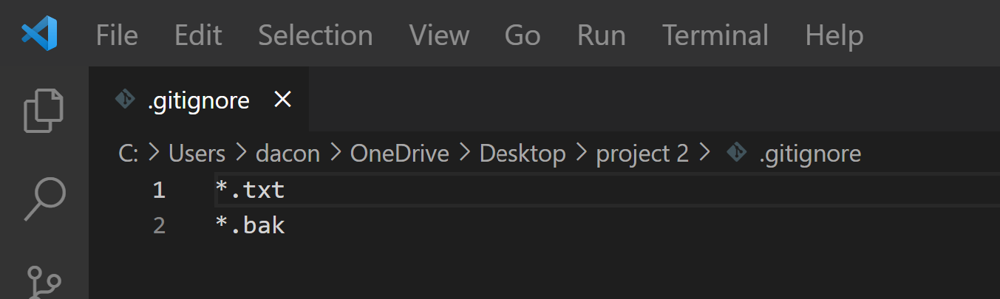

# Project 2
[RETURN TO HOMEPAGE](https://connor-pfeiffer.github.io/)

## Learning Objectives:

After completing this project, you will:

1. Gain experience using git via your CLI and Visual Studio Code (VSCode) Source Control

2. Gain experience writing and executing non-web server Node.js JavaScript code

3. Practice refactoring JavaScript code

## Overview:

Project elements:

1. Use the command line interface (CLI) of your operating system to create and work with a git repository (repo)

2. Refactor the JavaScript program from the previous project to practice using git and practice refactoring

3. Use git via VSCode

4. Create and use a .gitignore file

5. Diff split screen

## Project Deliverables:

1. [p2-random.js](p2-random.js)

2. [p2-random-files.txt](p2-random-files.txt)

3. [p2-random-commits.txt](p2-random-commits.txt)

4. [p2-expressions.js](p2-expressions.js)

5. refactor/.gitignore (screenshot)

6. p2-vscode-diff.png

